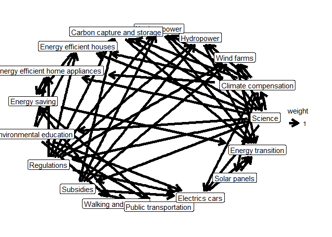
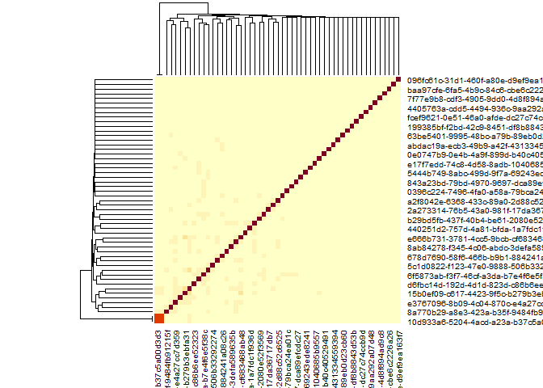
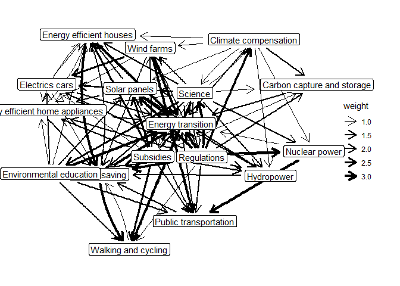

<!-- README.md is generated from README.Rmd. Please edit that file -->

# MToolR <a href="https://marioangst.github.io/MToolR/"></a>

<!-- badges: start -->
<!-- badges: end -->

MToolR is a companion package for the Mental Model Mapping Tool M-Tool
(<https://www.m-tool.org/>). The package provides: a) functionality to
load and process data generated by M-Tool b) procedures for common
(basic) analytical tasks c) visualization functions

⚠️ This package is at a relatively solid beta stage, with some
documentation lacking. Further features are planned. We welcome
feedback. ⚠️

## Installation

You can install the development version of MToolR from
[GitHub](https://github.com/) with:

``` r
# install.packages("devtools")
devtools::install_github("marioangst/MToolR")
```

⚠️ To install the package in this way you also need to have
[RTools](https://cran.r-project.org/bin/windows/Rtools/) installed.

## Example 1: Read in .csv file exported from M-Tool, visualize a user model and calculate some statistics for the user

Say you have exported a file called “example_export.csv” from M-Tool and
have saved it in a folder data-raw/. Here is how to read it into R and
create a first plot for a random user.

``` r
library(MToolR)
#> MToolR is a companion package for the Mental Model Mapping Tool M-Tool (https://www.m-tool.org/)
#> 
#>       Wouter van Boxtel wrote the initial scripts that inspired the functionality of this package. Thanks Wouter ;)!
#> 
#>     This package is under development. Use at your own risk. Help us by reporting bugs and create feature requests here: https://github.com/marioangst/MToolR/issues

mentalmodels <-
  MToolR::mentalmodel_from_csv("data-raw/example_export.csv", 
                           exclude_nonresponse = TRUE)

plot(mentalmodels, user = "ad84c4ed-b73e-4ba2-8e1f-edbe365bb225")
```



The mental models of users are stored as igraph graph objects for each
user. This makes it possible to calculate almost any network statistic
imaginable by retrieving the graph.

``` r
g <- get_user_graph(user = "ad84c4ed-b73e-4ba2-8e1f-edbe365bb225",
                    x = mentalmodels)
g
#> IGRAPH 9f37162 DNW- 17 14 -- 
#> + attr: name (v/c), Weight (e/n), weight (e/n)
#> + edges from 9f37162 (vertex names):
#> [1] Hydropower             ->Energy transition               
#> [2] Climate compensation   ->Nuclear power                   
#> [3] Environmental education->Energy efficient home appliances
#> [4] Subsidies              ->Electrics cars                  
#> [5] Environmental education->Walking and cycling             
#> [6] Science                ->Wind farms                      
#> [7] Nuclear power          ->Energy transition               
#> [8] Electrics cars         ->Energy efficient houses         
#> + ... omitted several edges
```

We have implemented some simple descriptive statistics in a convenience
function already:

``` r
calculate_descriptive_statistics(mentalmodel = mentalmodels)
#> # A tibble: 901 × 6
#>    concept                          w_betweenness w_in_d…¹ w_out…² w_tot…³ user 
#>    <chr>                                    <dbl>    <dbl>   <dbl>   <dbl> <chr>
#>  1 Energy transition                            0        3       0       3 d20f…
#>  2 Climate compensation                         0        0       0       0 d20f…
#>  3 Wind farms                                   0        3       0       3 d20f…
#>  4 Hydropower                                   0        0       0       0 d20f…
#>  5 Nuclear power                                0        0       0       0 d20f…
#>  6 Carbon capture and storage                   0        0       1       1 d20f…
#>  7 Regulations                                  0        0       1       1 d20f…
#>  8 Energy saving                                0        0       0       0 d20f…
#>  9 Walking and cycling                          0        0       0       0 d20f…
#> 10 Energy efficient home appliances             0        0       1       1 d20f…
#> # … with 891 more rows, and abbreviated variable names ¹​w_in_degree,
#> #   ²​w_out_degree, ³​w_total_degree
```

## Example 2: Similarities between mental models

It can be interesting to explore how similar the mental models of
different users are. MToolR implements a function to do so, based on
different graph similiarity metrics and which can also calculate
similarities within different user groups.

Let’s calculate the similarity matrix for the mental models of all users
in our example dataset.

``` r
sim_mat <- get_model_sims(mentalmodel = mentalmodels)
```

The raw similarity matrix can the be further processed in many possible
ways, for example as an input to a clustering algorithm to find groups
of users with similar mental models. We’ll plot a quick heatmap here, to
show what is possible.

``` r
heatmap(sim_mat)
```



In case you are wondering: There is very little similarity between user
mental models in this example data because we randomly shuffled user IDs
to anonymize the date ;)

You can also return the similarities between each pair of users in a
tibble data frame, by setting output to “tibble”.

``` r
sim_df <- get_model_sims(mentalmodel = mentalmodels, output = "tibble")

sim_df
#> # A tibble: 2,756 × 4
#>    user1                                user2                      method    sim
#>    <chr>                                <chr>                      <chr>   <dbl>
#>  1 ad84c4ed-b73e-4ba2-8e1f-edbe365bb225 d20f0ed5-da33-4e99-804e-3… gower  0     
#>  2 e666b731-3781-4cc5-9bcb-cf683468ab48 d20f0ed5-da33-4e99-804e-3… gower  0.0357
#>  3 10ecf726-69a7-48c9-9494-faa951cfddb5 d20f0ed5-da33-4e99-804e-3… gower  0.0588
#>  4 8ab84278-f345-4c06-abdc-3defa589635b d20f0ed5-da33-4e99-804e-3… gower  0.0556
#>  5 8a770b29-a8e3-423a-b35f-9484fb91215f d20f0ed5-da33-4e99-804e-3… gower  0     
#>  6 d6fd9156-10e3-4122-9094-1031230bd3e8 d20f0ed5-da33-4e99-804e-3… gower  0.118 
#>  7 b958c876-dbdc-4b91-9532-aba2ffb49831 d20f0ed5-da33-4e99-804e-3… gower  0     
#>  8 fd3490ab-badc-4b82-880f-fdbd23321b7a d20f0ed5-da33-4e99-804e-3… gower  0.0435
#>  9 e3767096-8b09-4c04-870c-e4a27cc7d359 d20f0ed5-da33-4e99-804e-3… gower  0.105 
#> 10 249711de-4e53-46a5-a6f3-8a64d057d1c0 d20f0ed5-da33-4e99-804e-3… gower  0     
#> # … with 2,746 more rows
```

Let’s for example look at the 10 users with the most similar models:

``` r
sim_df |> 
  dplyr::slice_max(order_by = sim, n = 10)
#> # A tibble: 10 × 4
#>    user1                                user2                       method   sim
#>    <chr>                                <chr>                       <chr>  <dbl>
#>  1 cbc68d75-23b8-4fef-9cef-c71fa9f7f088 10d933a6-5204-4acd-a23a-b3… gower  1    
#>  2 10d933a6-5204-4acd-a23a-b37c5a00d3d3 cbc68d75-23b8-4fef-9cef-c7… gower  1    
#>  3 15b0ef09-c617-4423-9f5c-b279b3ebfa31 ca8085e1-88fa-462f-8f66-98… gower  0.2  
#>  4 ca8085e1-88fa-462f-8f66-9806dab84fbb 15b0ef09-c617-4423-9f5c-b2… gower  0.2  
#>  5 4740a85d-ff80-41c8-bc69-1bb03e942b6c ca8085e1-88fa-462f-8f66-98… gower  0.176
#>  6 ca8085e1-88fa-462f-8f66-9806dab84fbb 4740a85d-ff80-41c8-bc69-1b… gower  0.176
#>  7 15b0ef09-c617-4423-9f5c-b279b3ebfa31 e666b731-3781-4cc5-9bcb-cf… gower  0.172
#>  8 e666b731-3781-4cc5-9bcb-cf683468ab48 15b0ef09-c617-4423-9f5c-b2… gower  0.172
#>  9 ca8085e1-88fa-462f-8f66-9806dab84fbb e666b731-3781-4cc5-9bcb-cf… gower  0.154
#> 10 e666b731-3781-4cc5-9bcb-cf683468ab48 ca8085e1-88fa-462f-8f66-98… gower  0.154
```

## Example 3: Aggregate models and calculate descriptive statistics

Often it is interesting to explore aggregated models of all M-Tool
respondents - a sort of meta-model.

Let’s first aggregate mental models using median edge weights and plot
the aggregated model.

``` r
mentalmodels_agg <- aggregate_mentalmodel(mentalmodels)
plot(mentalmodels_agg)
#> Using `stress` as default layout
```


We can then also calculate some descriptive statistics for the
aggregated model.

``` r
calculate_descriptive_statistics(mentalmodels_agg)
#> # A tibble: 17 × 5
#>    concept                          w_betweenness w_in_degree w_out_de…¹ w_tot…²
#>    <chr>                                    <dbl>       <dbl>      <dbl>   <dbl>
#>  1 Energy transition                         0             16          0      16
#>  2 Climate compensation                     16.5            3         10      13
#>  3 Wind farms                                0              5          6      11
#>  4 Hydropower                                0              5          3       8
#>  5 Nuclear power                             1              4          2       6
#>  6 Carbon capture and storage                1              4          2       6
#>  7 Regulations                               2.5            1         16      17
#>  8 Energy saving                            15             11          4      15
#>  9 Walking and cycling                       2.5            6          2       8
#> 10 Energy efficient home appliances          3              9          3      12
#> 11 Energy efficient houses                   3.5           10          3      13
#> 12 Subsidies                                 0              2         14      16
#> 13 Public transportation                     4.33           8          2      10
#> 14 Electrics cars                            3.33           7          3      10
#> 15 Environmental education                   0              3         10      13
#> 16 Solar panels                              3              5          7      12
#> 17 Science                                  14.5            4         16      20
#> # … with abbreviated variable names ¹​w_out_degree, ²​w_total_degree
```

## Example 4: Add additional data on users

Often, we might have collected additional data on users providing mental
models. We can add this data to a mtoolr object using add_user_data().

Here, we are just going to simulate some data. It’s important that our
user data contains a column matching users to their M-Tool user id.

``` r
# simulate user data to add
user_df <- tibble::tibble(id = example_models$user_data$id,
                      user_likes_bicycles = rbinom(length(example_models$user_data$id),
                                                   size = 1,prob = 0.5))
user_df
#> # A tibble: 53 × 2
#>    id                                   user_likes_bicycles
#>    <chr>                                              <int>
#>  1 d20f0ed5-da33-4e99-804e-39fb03cf8f3c                   1
#>  2 ad84c4ed-b73e-4ba2-8e1f-edbe365bb225                   1
#>  3 e666b731-3781-4cc5-9bcb-cf683468ab48                   0
#>  4 10ecf726-69a7-48c9-9494-faa951cfddb5                   1
#>  5 8ab84278-f345-4c06-abdc-3defa589635b                   0
#>  6 8a770b29-a8e3-423a-b35f-9484fb91215f                   0
#>  7 d6fd9156-10e3-4122-9094-1031230bd3e8                   0
#>  8 b958c876-dbdc-4b91-9532-aba2ffb49831                   0
#>  9 fd3490ab-badc-4b82-880f-fdbd23321b7a                   1
#> 10 e3767096-8b09-4c04-870c-e4a27cc7d359                   1
#> # … with 43 more rows
```

Now we can add the user data to the mtoolr object we created earlier:

``` r
# add user data
mentalmodels <- mentalmodels |> add_user_data(user_data = user_df,
                                                  id_key = "id")
```

We can use this data now for example to aggregate models by group (here
for users who like bicycles) and plot the group model.

``` r
agg_model_likes_bicycles <- aggregate_mentalmodel(
  mentalmodels, group_var = "user_likes_bicycles", group_value = 1
)
plot(agg_model_likes_bicycles)
#> Using `stress` as default layout
```



<!-- build this with devtools::build_readme() -->
