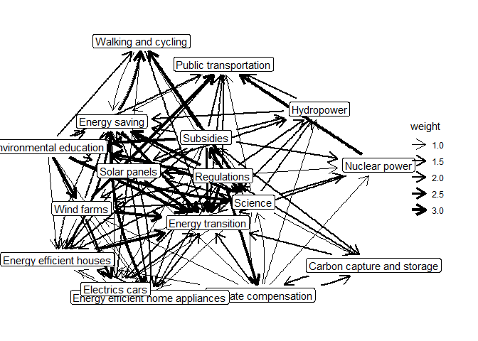

<!-- README.md is generated from README.Rmd. Please edit that file -->

# MToolR

<!-- badges: start -->
<!-- badges: end -->

MToolR is a companion package for the Mental Model Mapping Tool M-Tool
(<https://www.m-tool.org/>). The package provides: a) functionality to
load and process data generated by M-Tool b) procedures for common
(basic) analytical tasks c) visualization functions

⚠️ This package is at a relatively solid beta stage, with some
documentation lacking. Further features are planned. We welcome
feedback. ⚠️

## Installation

You can install the development version of MToolR from
[GitHub](https://github.com/) with:

``` r
# install.packages("devtools")
devtools::install_github("marioangst/MToolR")
```

## Example 1: Read in .csv file exported from M-Tool, aggregate and visualize

Say you have exported a file called “example_export.csv” from M-Tool and
have saved it in a folder data-raw/. Here is how to read it into R and
create a first plot for a random user.

``` r
library(MToolR)
#> MToolR is a companion package for the Mental Model Mapping Tool M-Tool (https://www.m-tool.org/)
#> 
#>       Wouter van Boxtel wrote the initial scripts that inspired the functionality of this package. Thanks Wouter ;)!
#> 
#>     This package is under development. Use at your own risk. Help us by reporting bugs and create feature requests here: https://github.com/marioangst/MToolR/issues

mentalmodels <-
  MToolR::mentalmodel_from_csv("data-raw/example_export.csv", 
                           exclude_nonresponse = TRUE)

plot(mentalmodels, user = "ad84c4ed-b73e-4ba2-8e1f-edbe365bb225")
```


## Example 2: Aggregate models and calculate descriptive statistics

These are functions operating on igraph objects, so a lot is possible.

Let’s first aggregate mental models using median edge weights and plot
the aggregated model.

``` r
mentalmodels_agg <- aggregate_mentalmodel(mentalmodels)
plot(mentalmodels_agg)
#> Using "stress" as default layout
```



We can then calculate some first summary statistics for the aggregated
model:

``` r
calculate_descriptive_statistics(mentalmodels_agg)
#> # A tibble: 17 x 5
#>    concept                          w_betweenness w_in_degree w_out_de~1 w_tot~2
#>    <chr>                                    <dbl>       <dbl>      <dbl>   <dbl>
#>  1 Energy transition                         0             16          0      16
#>  2 Climate compensation                     16.5            3         10      13
#>  3 Wind farms                                0              5          6      11
#>  4 Hydropower                                0              5          3       8
#>  5 Nuclear power                             1              4          2       6
#>  6 Carbon capture and storage                1              4          2       6
#>  7 Regulations                               2.5            1         16      17
#>  8 Energy saving                            15             11          4      15
#>  9 Walking and cycling                       2.5            6          2       8
#> 10 Energy efficient home appliances          3              9          3      12
#> 11 Energy efficient houses                   3.5           10          3      13
#> 12 Subsidies                                 0              2         14      16
#> 13 Public transportation                     4.33           8          2      10
#> 14 Electrics cars                            3.33           7          3      10
#> 15 Environmental education                   0              3         10      13
#> 16 Solar panels                              3              5          7      12
#> 17 Science                                  14.5            4         16      20
#> # ... with abbreviated variable names 1: w_out_degree, 2: w_total_degree
```

<!-- build this with devtools::build_readme() -->
